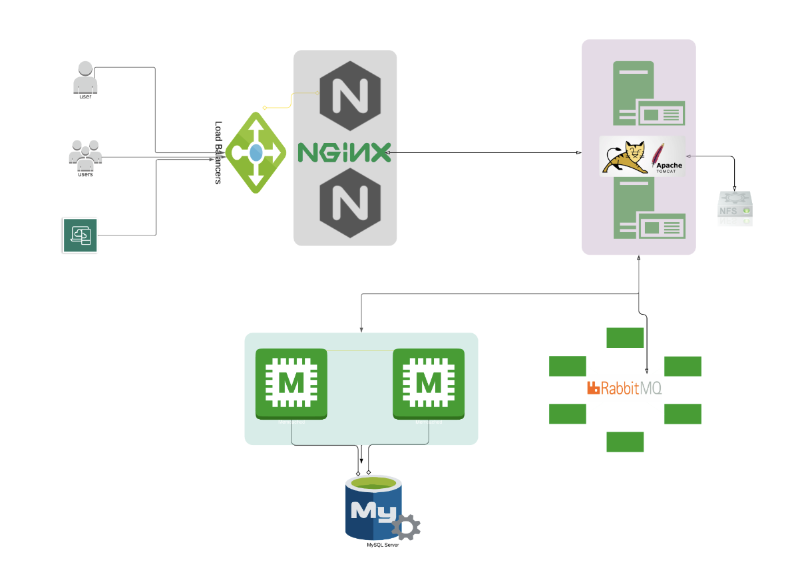

# Web Application Infrastructure

This document provides an overview of a web application's infrastructure as depicted in the provided architecture diagram.

## Overview

The diagram illustrates a highly scalable and reliable web application architecture designed for efficient traffic handling and robust backend processing.

### Components and Workflow

1. **Users and Clients**:
   - End-users access the application through various client devices (browsers, mobile apps, etc.).
   - Requests are directed to the system through load balancers.

2. **Load Balancers**:
   - Distribute incoming traffic evenly across the Nginx servers.
   - Ensure high availability and prevent overloading of any single component.

3. **Nginx Layer**:
   - Acts as a reverse proxy, routing requests from load balancers to backend **Apache Tomcat** servers.
   - Provides caching and serves static content when necessary.

4. **Apache Tomcat Servers**:
   - The primary application servers where the core web application resides.
   - They process incoming requests and communicate with the **MySQL** database and **RabbitMQ** message broker.
   - Tomcat also interacts with the **NFS (Network File System)** for file storage operations.

5. **MySQL Database**:
   - Handles data storage and retrieval for the application.
   - Supports critical application functionalities with structured data storage.

6. **RabbitMQ**:
   - A messaging broker for handling asynchronous communication between services.
   - Facilitates task queuing and load distribution across the system.

7. **Microservices Layer**:
   - Represented as "M" in the diagram.
   - Lightweight services interacting with MySQL and RabbitMQ to handle specific business logic or application features.

8. **NFS (Network File System)**:
   - Provides shared file storage.
   - Accessible by Tomcat servers for managing application files.

## Key Features

- **Scalability**: The architecture supports horizontal scaling through load balancers and distributed components.
- **Reliability**: Redundant components ensure high availability and fault tolerance.
- **Performance**: Nginx handles large traffic volumes efficiently, and RabbitMQ enables asynchronous processing.
- **Modularity**: The use of microservices separates responsibilities, making the system easier to maintain and extend.

## Diagram Attribution

The diagram embedded above visualizes the architecture and helps better understand the interactions between different components.

---

# Prerequisites
#
- JDK 11 
- Maven 3 
- MySQL 8

# Technologies 
- Spring MVC
- Spring Security
- Spring Data JPA
- Maven
- JSP
- Tomcat
- MySQL
- Memcached
- Rabbitmq
- ElasticSearch
# Database
Here,we used Mysql DB 
sql dump file:
- /src/main/resources/db_backup.sql
- db_backup.sql file is a mysql dump file.we have to import this dump to mysql db server
- > mysql -u <user_name> -p accounts < db_backup.sql